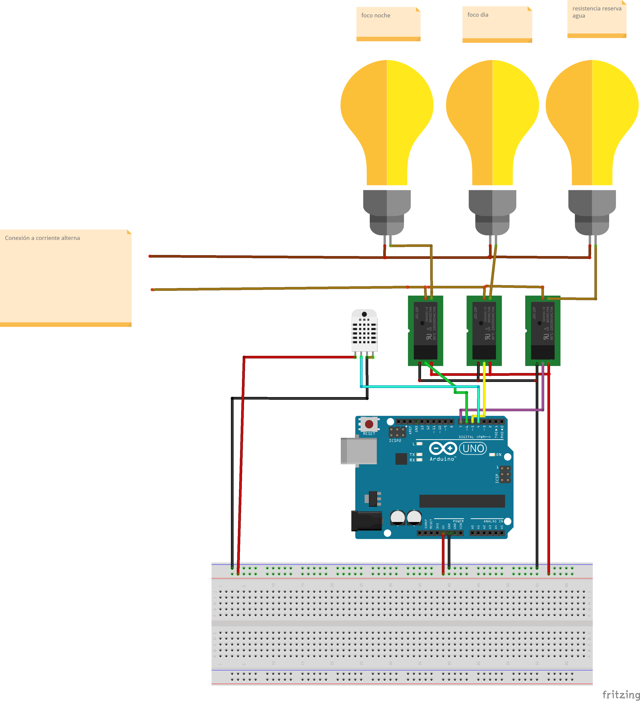

# Terrarium manager

## The project
The purpose of this project is to manage the parameters of my pet that is a snake.
 
The data that will be processed is going to be the temperature and humidity with a dht22 sensor, a submersible temperature sensor and an automatic system for spreading water in order to humidify the terrarium every time the humidity is over 50%.
 
The spotlights will be turned on or off according to the temperature and it will light the night or dauy according to the time of day that will be received through an external API connected with the application.
 
Also the water will be warm with another sensor for keep warm the reserve of water and the trough will be filled automatically when the water float sensor is activated.
 
More functionalities are going to be developed with the time
  

## Rasp Berry python program
The user interface will be developed with python using electron and flask microframework for the graphic interface in order to show all the data we need with an interface which is builded with css.
 
The program will process the data that comes from the arduino via USB and the python program will be processing this data.
All this in order to be showed through a display connected to the raspberry.
 

### Installation, libraries and considerations
* For its correct installation and use you need first python3 and pip3 installed in your raspberry.
* The project uses Ubuntu mate OS for the raspberry.
* The model of the raspberry is pi4 B+.
* You can use raspberry models like pi3 and pi3b but are not still tested in this ones.
* USB cable for connect both boards between them.
* Execute python3 InstalacionBase.py in order to install all python libraries and configuration needed for this project.
  

## Arduino program
The Arduino is used in order to acquire the parameters we want to show through the LCD of the raspberry.
 
All the necesary data will be displayed in the display of the raspberry for its correct manage from the user.

### Installation, libraries and considerations
* First you need to use an Arduino uno board in order to use the same pins as the program, if not consider that you will need to change the default pins.
* You need the IDE of Arduino for upload the Arduino program to your board.
* You need to install from the IDE the dht.h library from adafruit in order to read the dht sensor and include it in the program.
* If you´re using s linux distribution to upload the file to the Arduino remember to enable the permissions of writing over the USB port.

## Sensor´s and materials list used
* dht22 humidity and temperature sensor
* Horn of 2 inches of 1.5 watts
* Water float sensor
* Raspberry pi 4 B+
* LCD touch display of 7 inches
* 256 gb SD
* 3 relays
* 1 L298D chip (H bridge)

## Connection diagram
Here is the diagram connection about how you need to connect all components, to which pin´s, etc.

  

# The project is open and still on development